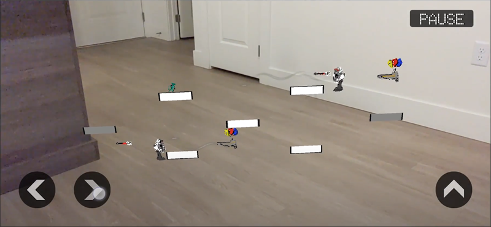

<h1 align="center">
 
Jump Monke Jump
</h1>

<h3 align="center"><a href="https://drive.google.com/file/d/1LXjcpI-s62RsSR9_abuUP_bVnK5yJsJj/view?usp=sharing">Artifact Video</a></h3>

<h3 align="center"><a href="https://www.boisestate.edu/gimm/">GIMM</a> 110 - Interactive Programming </h3>
<h5 align="center"><a href="https://www.boisestate.edu/">Boise State University</a> (Fall 2022) </h5>

<h4 align="center">An Android application that uses the camera’s AR capabilities to place a competitive, 2-player platformer game in the real world.</h4>

  <a href="#project-overview">Project Overview</a> •
  <a href="#technical-stack">Technical Stack</a> •
  <a href="#collaborators">Collaborators</a> •
  <a href="#contact">Contact</a>

## Project Overview

Using an Android phone or tablet's AR functionality, two players take turns competing in a 2D platformer that is placed in real world space. If both players are able to complete the level, a player is then allowed to place a randomized obstacle to make the game more difficult to complete. The goal is to make the game too hard for the opposing player to pass, but still doable for yourself, as to avoid a loss or tie.

## Technical Stack

 

## Collaborators

<h3>Chase Franklin:</h3>

Project Leader • Programmer

<h3>Carson Strout:</h3>

Lead Programmer

<h3>Sam Lummus:</h3>

Programmer

<h3>Jackson Neal:</h3>

Lead Artist

<h3>Kevin Sherwood:</h3>

Artist

## Contact

<h3>Chase Franklin</h3>

 

<h3>Carson Strout</h3>

 
 

<h3>Sam Lummus</h3>

<h3>Jackson Neal</h3>

<h3>Kevin Sherwood</h3>

 
